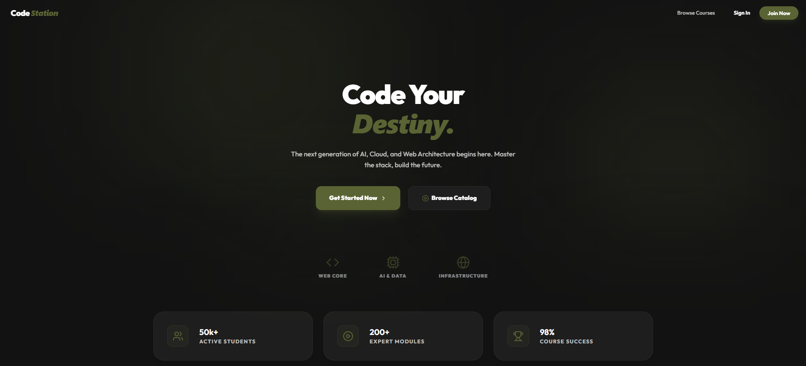
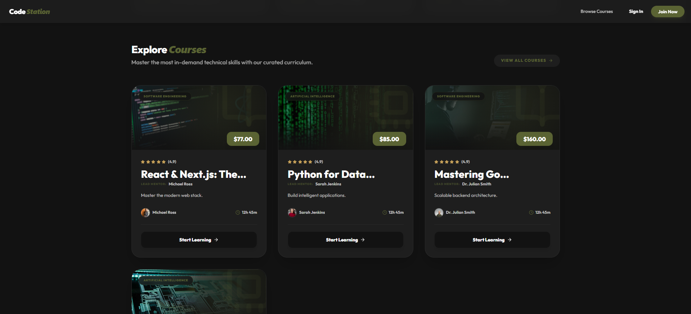
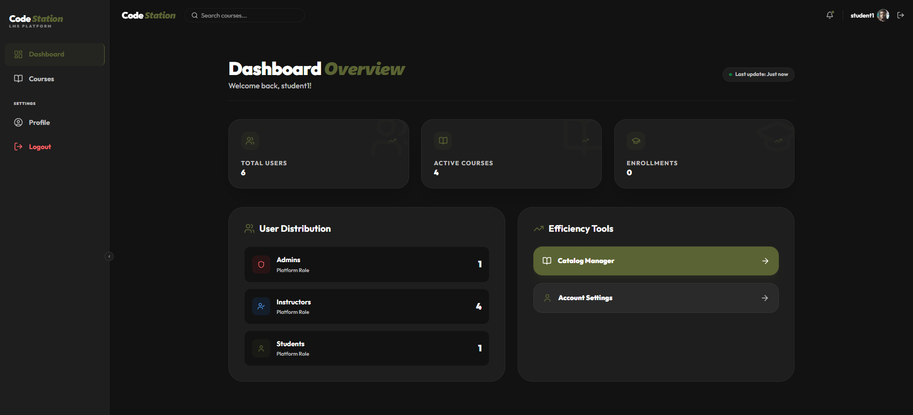
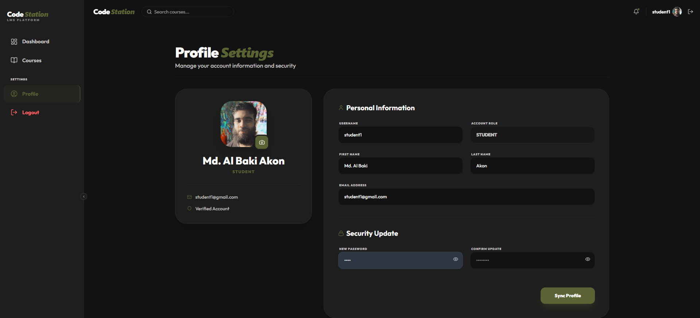
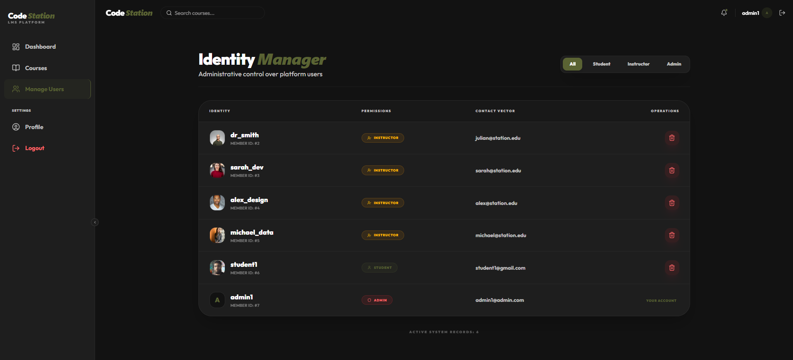

# 🎓 Code Station - Learning Management System

<div align="center">


**A modern, full-stack Learning Management System built with Django & React**

[](https://www.djangoproject.com/)
[](https://reactjs.org/)
[](https://tailwindcss.com/)

</div>

---

## 📖 About

Code Station is a premium Learning Management System designed for modern educational institutions. It features role-based access control (Admin, Instructor, Student), course management, enrollment tracking, and real-time analytics with a beautiful dark-themed UI.

---

## ✨ Features

### 👥 User Roles
- **Admin** - User management, system analytics, platform oversight
- **Instructor** - Create courses, manage content, track student progress
- **Student** - Browse courses, enroll, track learning progress

---

### 📚 Core Functionality
- JWT-based authentication with secure login/logout
- Course creation with thumbnails, pricing, and categories
- One-click enrollment system
- Personalized dashboards for each role
- Search and filter courses by category
- Profile management with avatar upload
- Responsive design for all devices

---

## 📸 Screenshots

### Landing Page


### Course Catalog


### Student Dashboard


### Profile Settings


### Admin - User Management


---

## 🛠️ Tech Stack

**Backend:** Django 4.2, Django REST Framework, JWT Authentication  
**Frontend:** React 18, Vite, Tailwind CSS, Framer Motion  
**Database:** SQLite (Development) / PostgreSQL (Production)

---

## 📦 Installation

### Prerequisites
- Python 3.10+
- Node.js 18+
- Git

### Backend Setup

```bash
# Clone repository
git clone https://github.com/yourusername/django-react-lms.git
cd django-react-lms

# Create virtual environment
python -m venv venv

# Activate virtual environment
# Windows:
venv\Scripts\activate
# macOS/Linux:
source venv/bin/activate

# Install dependencies
pip install -r requirements.txt

# Run migrations
python manage.py migrate

# Create superuser
python manage.py createsuperuser

# Seed sample data (optional)
python seed_data.py

# Start server
python manage.py runserver
```

Backend runs at: `http://localhost:8000`

---

### Frontend Setup

```bash
# Navigate to frontend
cd frontend

# Install dependencies
npm install

# Start development server
npm run dev
```

Frontend runs at: `http://localhost:5174`

---

## 🤝 Contributing

Contributions are welcome! Please:
1. Fork the repository
2. Create a feature branch
3. Commit your changes
4. Push and open a Pull Request

---

## 👨 Author

**Md. Al Baki Akon**  
GitHub: [mdalbakiakon](https://github.com/mdalbakiakon)  
Email: mdalbakiakon@gmail.com


---

<div align="center">

**Developed by Md. Al Baki Akon**
⭐ Star this repo if you find it helpful!

</div>
